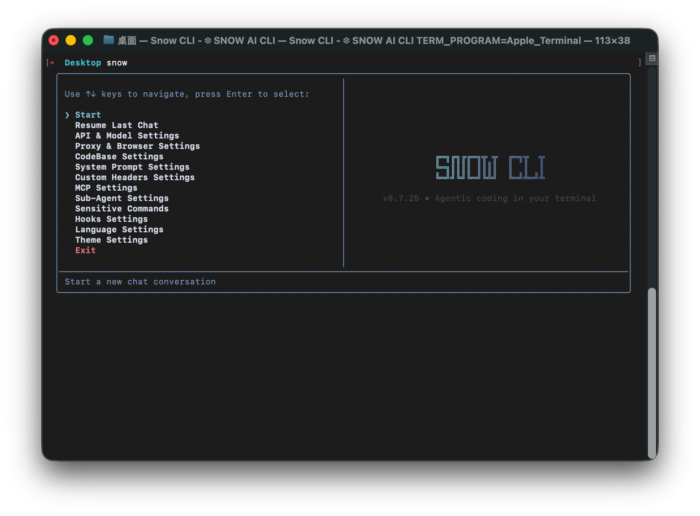
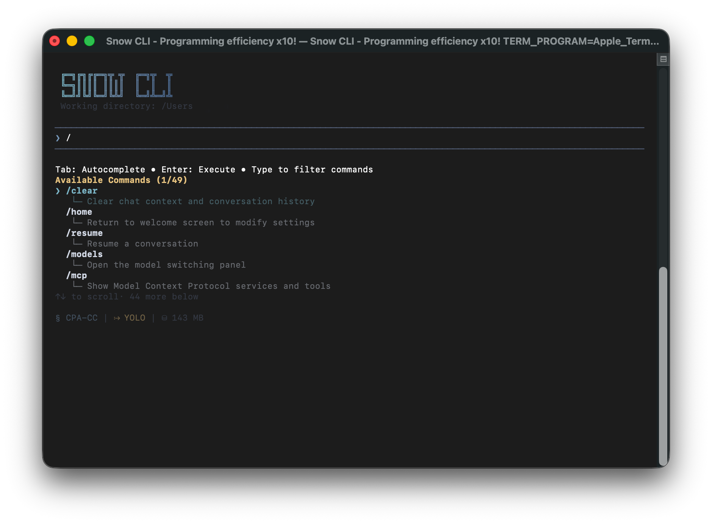

<div align="center">


# snow-ai

[](https://www.npmjs.com/package/snow-ai)
[](https://www.npmjs.com/package/snow-ai)
[](https://github.com/MayDay-wpf/snow-cli/blob/main/LICENSE)
[](https://nodejs.org/)

<a href="https://www.producthunt.com/products/snow-cli/launches/snow-cli?embed=true&amp;utm_source=badge-featured&amp;utm_medium=badge&amp;utm_campaign=badge-snow-cli" target="_blank" rel="noopener noreferrer"></a>

**English** | [中文](README_zh.md)

**QQ Group**: 910298558

**Telegram**: [https://t.me/snow_cli](https://t.me/snow_cli)

**AI Community**: [https://linux.do](https://linux.do)

_Agentic coding in your terminal_

</div>

## Thanks Developer

<a href="https://github.com/MayDay-wpf/snow-cli/graphs/contributors">
  
</a>

## Sponsors

| Sponsor                               | Description                      |
| ------------------------------------- | -------------------------------- |
| [acker798.xyz](https://acker798.xyz/) | AI Relay Station, supports Codex |





<h3>Recommend using fonts: <a href="https://github.com/SpaceTimee/Fusion-JetBrainsMapleMono">JetBrains Maple Mono NF</a> </3>

<h3>Recommended Terminal Combination for Windows Users</h3>

- **PowerShell 7+**: Modern cross-platform PowerShell, offering stronger features and better compatibility
  - GitHub: https://github.com/PowerShell/PowerShell
- **Windows Terminal**: Modern terminal application, supporting multi-tab, split-screen, and GPU accelerated rendering
  - GitHub: https://github.com/microsoft/terminal

**Installation**:

```bash
# Install using winget (built-in for Windows 10/11)
winget install Microsoft.PowerShell
winget install Microsoft.WindowsTerminal

# Or install using the Microsoft Store
```

## Documentation

- [Installation Guide](docs/usage/en/01.Installation%20Guide.md) - System requirements, installation (update, uninstall) steps, IDE extension installation
- [First Time Configuration](docs/usage/en/02.First%20Time%20Configuration.md) - API configuration, model selection, basic settings
- [Startup Parameters Guide](docs/usage/en/19.Startup%20Parameters%20Guide.md) - Command-line parameters explained, quick start modes, headless mode, async tasks, developer mode

### Advanced Configuration

- [Proxy and Browser Settings](docs/usage/en/03.Proxy%20and%20Browser%20Settings.md) - Network proxy configuration, browser usage settings
- [Codebase Setup](docs/usage/en/04.Codebase%20Setup.md) - Codebase integration, search configuration
- [Sub-Agent Configuration](docs/usage/en/05.Sub-Agent%20Configuration.md) - Sub-agent management, custom sub-agent configuration
- [Sensitive Commands Configuration](docs/usage/en/06.Sensitive%20Commands%20Configuration.md) - Sensitive command protection, custom command rules
- [Hooks Configuration](docs/usage/en/07.Hooks%20Configuration.md) - Workflow automation, hook types explanation, practical configuration examples
- [Theme Settings](docs/usage/en/08.Theme%20Settings.md) - Interface theme configuration, custom color schemes, simplified mode
- [Third-Party Relay Configuration](docs/usage/en/16.Third-Party%20Relay%20Configuration.md) - Claude Code relay, Codex relay, custom headers configuration

### Feature Guide

- [Command Panel Guide](docs/usage/en/09.0.Command%20Panel%20Guide.md) - Detailed description of all available commands, usage tips, shortcut key reference (split into 09.1~09.7 sub-documents by category)
- [Command Injection Mode](docs/usage/en/10.Command%20Injection%20Mode.md) - Execute commands directly in messages, syntax explanation, security mechanisms, use cases
- [Vulnerability Hunting Mode](docs/usage/en/11.Vulnerability%20Hunting%20Mode.md) - Professional security analysis, vulnerability detection, verification scripts, detailed reports
- [Headless Mode](docs/usage/en/12.Headless%20Mode.md) - Command line quick conversations, session management, script integration, third-party tool integration
- [Keyboard Shortcuts Guide](docs/usage/en/13.Keyboard%20Shortcuts%20Guide.md) - All keyboard shortcuts, editing operations, navigation control, rollback functionality
- [MCP Configuration](docs/usage/en/14.MCP%20Configuration.md) - MCP service management, configure external services, enable/disable services, troubleshooting
- [Async Task Management](docs/usage/en/15.Async%20Task%20Management.md) - Background task creation, task management interface, sensitive command approval, task to session conversion
- [Skills Command Detailed Guide](docs/usage/en/18.Skills%20Command%20Detailed%20Guide.md) - Skill creation, usage methods, Claude Code Skills compatibility, tool restrictions
- [LSP Configuration and Usage](docs/usage/en/17.LSP%20Configuration.md) - LSP config file, language server installation, ACE tool usage (definition/outline)
- [SSE Service Mode](docs/usage/en/20.SSE%20Service%20Mode.md) - SSE server startup, API endpoints explanation, tool confirmation flow, permission configuration, YOLO mode, client integration examples
- [Custom StatusLine Guide](docs/usage/en/21.Custom%20StatusLine%20Guide.md) - User-level StatusLine plugins, hook structure, override behavior, bilingual examples
- [Team Mode Guide](docs/usage/en/22.Team%20Mode%20Guide.md) - Multi-agent collaboration, parallel task execution, team management
- [Custom Search Engine Guide](docs/usage/en/23.Custom%20Search%20Engine%20Guide.md) - User-level search engine plugins, engine contract, enable flag, minimal template

### Recommended ROLE.md

- [Recommended ROLE.md](docs/role/en/01.Snow%20CLI%20Plan%20Every%20Step.md) - Recommended behavior guidelines, work mode, and quality standards for the Snow CLI terminal programming assistant
  - Bilingual documentation: English (primary) / [Chinese](docs/role/zh/01.Snow%20CLI%20一步一规划.md)
  - Maintenance rule: Keep Chinese and English structures aligned; tool names remain unchanged

---

## Development Guide

### Prerequisites

- **Node.js >= 18.x** (Requires ES2020 features support)
- npm >= 8.3.0

Check your Node.js version:

```bash
node --version
```

If your version is below 18.x, please upgrade first:

```bash
# Using nvm (recommended)
nvm install 18
nvm use 18

# Or download from official website
# https://nodejs.org/
```

### Build from Source

```bash
git clone https://github.com/MayDay-wpf/snow-cli.git
cd snow-cli
npm install
npm run link   # builds and globally links snow
# to remove the link later: npm run unlink
```

### IDE Extension Development

#### VSCode Extension

- Extension source located in `VSIX/` directory
- Download release: [mufasa.snow-cli](https://marketplace.visualstudio.com/items?itemName=mufasa.snow-cli)

#### JetBrains Plugin

- Plugin source located in `Jetbrains/` directory
- Download release: [JetBrains plugin](https://plugins.jetbrains.com/plugin/28715-snow-cli/edit)

### Project Structure

```
source/                     # Source code
├── agents/                 # AI agents implementation
├── api/                    # LLM API adapters
├── hooks/                  # React hooks for conversation
├── i18n/                   # Internationalization
├── mcp/                    # Model Context Protocol
├── prompt/                 # System prompt templates
├── types/                  # TypeScript type definitions
├── ui/                     # UI components (Ink)
└── utils/                  # Utility functions

bundle/                     # Build output (single-file executable)
dist/                       # TypeScript compilation output
docs/                       # Documentation
JetBrains/                  # JetBrains plugin source
scripts/                    # Build and utility scripts
VSIX/                       # VSCode extension source
```

### User Configuration Directory

After running snow, `.snow/` directory is created in your home folder:

```
~/.snow/                    # User configuration directory
├── log/                    # Runtime logs (local, can be deleted)
├── profiles/               # Configuration profiles
├── sessions/               # Conversation history
├── tasks/                  # Async tasks
├── hooks/                  # Workflow hooks
├── config.json             # API configuration
├── mcp-config.json         # MCP configuration
└── ...                     # Other config files
```

## Star History

[](https://star-history.com/#MayDay-wpf/snow-cli&Date)
