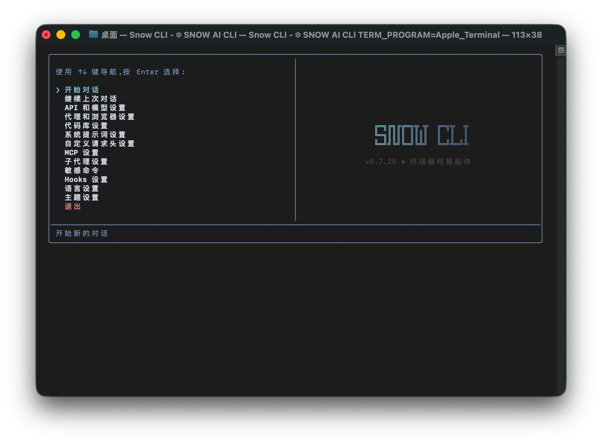
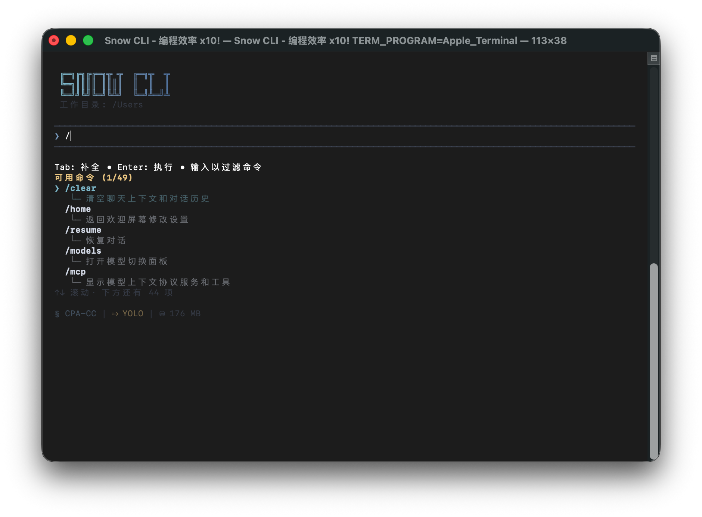

<div align="center">


# snow-ai

[](https://www.npmjs.com/package/snow-ai)
[](https://www.npmjs.com/package/snow-ai)
[](https://github.com/MayDay-wpf/snow-cli/blob/main/LICENSE)
[](https://nodejs.org/)

<a href="https://www.producthunt.com/products/snow-cli/launches/snow-cli?embed=true&amp;utm_source=badge-featured&amp;utm_medium=badge&amp;utm_campaign=badge-snow-cli" target="_blank" rel="noopener noreferrer"></a>

[English](README.md) | **中文**

**QQ 群**: 910298558

**Telegram**: [https://t.me/snow_cli](https://t.me/snow_cli)

**AI 社区**: [https://linux.do](https://linux.do)

_在终端中进行 Agentic 编程_

</div>

## 感谢开发者

<a href="https://github.com/MayDay-wpf/snow-cli/graphs/contributors">
  
</a>

## 赞助商

<table width="100%">
  <thead>
    <tr>
      <th width="50%">赞助商</th>
      <th width="50%">介绍</th>
    </tr>
  </thead>
  <tbody>
    <tr>
      <td><a href="https://acker798.xyz/">acker798.xyz</a></td>
      <td>AI 中转站，支持 Codex</td>
    </tr>
    <tr>
      <td><a href="https://www.jetbrains.com/">JetBrains</a></td>
      <td>开源项目赞助者，提供全套 IDE 免费许可证</td>
    </tr>
  </tbody>
</table>





<h3>推荐使用字体：<a href="https://github.com/SpaceTimee/Fusion-JetBrainsMapleMono">JetBrains Maple Mono NF</a> </3>

<h3>Windows 用户推荐终端组合</h3>

- **PowerShell 7+**: 现代化的跨平台 PowerShell，提供更强的功能和更好的兼容性
  - GitHub: https://github.com/PowerShell/PowerShell
- **Windows Terminal**: 现代化的终端应用程序，支持多标签、分屏、GPU 加速渲染
  - GitHub: https://github.com/microsoft/terminal

**安装方式**:

```bash
# 使用 winget 安装 (Windows 10/11 自带)
winget install Microsoft.PowerShell
winget install Microsoft.WindowsTerminal

# 或使用 Microsoft Store 安装
```

## 文档目录

- [安装指南](docs/usage/zh/01.安装指南.md) - 系统要求、安装(更新、卸载)步骤、IDE 扩展安装
- [首次配置](docs/usage/zh/02.首次配置.md) - API 配置、模型选择、基础设置
- [启动参数说明](docs/usage/zh/19.启动参数说明.md) - 命令行参数详解、快速启动模式、无头模式、异步任务、开发者模式

### 高级配置

- [代理和浏览器设置](docs/usage/zh/03.代理和浏览器设置.md) - 网络代理配置、浏览器使用设置
- [代码库设置](docs/usage/zh/04.代码库设置.md) - 代码库集成、搜索配置
- [子代理设置](docs/usage/zh/05.子代理设置.md) - 子代理管理、自定义子代理配置
- [敏感命令配置](docs/usage/zh/06.敏感命令配置.md) - 敏感命令保护、自定义命令规则
- [Hooks 配置](docs/usage/zh/07.Hooks配置.md) - 工作流程自动化、Hook 类型说明、实用配置示例
- [主题设置](docs/usage/zh/08.主题设置.md) - 界面主题配置、自定义配色、简洁模式
- [第三方中转配置](docs/usage/zh/16.第三方中转配置.md) - Claude Code 中转、Codex 中转、自定义请求头配置

### 功能指南

- [指令面板说明](docs/usage/zh/09.0.指令面板说明.md) - 所有可用指令的详细说明、使用技巧、快捷键参考（按类目拆分为 09.1~09.7 子文档）
- [命令注入模式](docs/usage/zh/10.命令注入模式.md) - 消息中直接执行命令、语法说明、安全机制、使用场景
- [漏洞猎人模式](docs/usage/zh/11.漏洞猎人模式.md) - 专业安全分析、漏洞检测、验证脚本、详细报告
- [无头模式](docs/usage/zh/12.无头模式.md) - 命令行快速对话、会话管理、脚本集成、第三方工具集成
- [快捷键指南](docs/usage/zh/13.快捷键指南.md) - 所有快捷键说明、编辑操作、导航控制、回滚功能
- [MCP 配置](docs/usage/zh/14.MCP配置.md) - MCP 服务管理、配置外部服务、启用/禁用服务、故障排除
- [异步任务管理](docs/usage/zh/15.异步任务管理.md) - 后台任务创建、任务管理界面、敏感命令审批、任务转会话
- [Skills 指令详细说明](docs/usage/zh/18.Skills指令详细说明.md) - 技能创建、使用方法、Claude Code Skills 兼容性、工具限制
- [LSP 配置与用法](docs/usage/zh/17.LSP配置.md) - LSP 配置文件、语言服务器安装、ACE 工具用法(跳转/大纲)
- [SSE 服务模式](docs/usage/zh/20.SSE服务模式.md) - SSE 服务器启动、API 端点说明、工具确认流程、权限配置、YOLO 模式、客户端集成示例
- [自定义 StatusLine 指南](docs/usage/zh/21.自定义StatusLine指南.md) - 用户级状态栏插件、hook 结构、覆盖机制、中英文示例
- [Team 模式指南](docs/usage/zh/22.Team模式指南.md) - 多智能体协作、并行任务执行、团队管理
- [自定义搜索引擎指南](docs/usage/zh/23.自定义搜索引擎指南.md) - 用户级搜索引擎插件、引擎合约、enable 开关、最小模板示例

### 推荐使用的 ROLE.md

- [推荐使用的 ROLE.md](docs/role/zh/01.Snow%20CLI%20一步一规划.md) - Snow CLI 终端编程助手推荐使用的行为准则、工作模式与质量标准
  - 双语文档：中文（主版本）/[英文](docs/role/en/01.Snow%20CLI%20Plan%20Every%20Step.md)
  - 维护规则：保持中英文结构对齐，工具名称保持不变

---

## 开发指南

### 环境要求

- **Node.js >= 18.x** (需要 ES2020 特性支持)
- npm >= 8.3.0

检查你的 Node.js 版本：

```bash
node --version
```

如果版本低于 18.x，请先升级：

```bash
# 使用 nvm (推荐)
nvm install 18
nvm use 18

# 或从官网下载
# https://nodejs.org/
```

### 源码构建

```bash
git clone https://github.com/MayDay-wpf/snow-cli.git
cd snow-cli
npm install
npm run link   # 构建并全局链接 snow
# 之后删除链接: npm run unlink
```

### IDE 扩展开发

#### VSCode 扩展

- 扩展源码位于 `VSIX/` 目录
- 下载发布版: [mufasa.snow-cli](https://marketplace.visualstudio.com/items?itemName=mufasa.snow-cli)

#### JetBrains 插件

- 插件源码位于 `Jetbrains/` 目录
- 下载发布版: [JetBrains 插件](https://plugins.jetbrains.com/plugin/28715-snow-cli/edit)

### 项目结构

```
source/                     # 源代码
├── agents/                 # AI 代理实现
├── api/                    # LLM API 适配器
├── hooks/                  # 对话 React Hooks
├── i18n/                   # 国际化
├── mcp/                    # Model Context Protocol
├── prompt/                 # 系统提示词模板
├── types/                  # TypeScript 类型定义
├── ui/                     # UI 组件 (Ink)
└── utils/                  # 工具函数

bundle/                     # 构建输出（单文件可执行）
dist/                       # TypeScript 编译输出
docs/                       # 文档
JetBrains/                  # JetBrains 插件源码
scripts/                    # 构建和工具脚本
VSIX/                       # VSCode 扩展源码
```

### 用户配置目录

运行 snow 后，会在主目录创建 `.snow/` 文件夹：

```
~/.snow/                    # 用户配置目录
├── log/                    # 运行日志(本地，可删除)
├── profiles/               # 配置文件
├── sessions/               # 对话记录
├── tasks/                  # 异步任务
├── hooks/                  # 工作流钩子
├── config.json             # API 配置
├── mcp-config.json         # MCP 配置
└── ...                     # 其他配置文件
```

## Star History

[](https://star-history.com/#MayDay-wpf/snow-cli&Date)
